GAA-7007\_Devoir\_5
================
Marc Duchemin
2020-04-25

<center>


</center>

<center>

# **GAA-7007**

# **Analyse et modélisation d’agroécosystèmes**

## **Évaluation sommative 5**

## **Analyse des séries temporelles**

### **Présenté par :**

### **Marc Duchemin**

### **à :**

### **Serge-Étienne Parent**

</center>

### ————————————————————————————————————-

<style>
body {
text-align: justify}
</style>

# **1 Introduction**

## **1.1 Contexte**

La modélisation d’agroécosystèmes fait partie intégrante du domaine de
la science des données (*data science*). Un projet en science des
données comprend trois grandes étapes : la collecte des données,
l’investigation des données et la communication des résultats. Ces
étapes peuvent s’effectuer à l’aide du **logiciel de programmation R**
qui s’impose de plus en plus en raison des récents développements de
modules d’analyse, de modélisation et de visualisation. Cette 5ème
évaluation sommative porte sur le traitement des **séries temporelles**
de données.

## **1.2 Objectifs**

À partir de concentrations de CO<sub>2</sub> atmosphérique (ppm)
mesurées au *Mauna Loa Observatory* (Hawaï, USA) entre 1958 et 2001, il
s’agissait de : (1) charger les données initiales et créer une série
temporelle de CO<sub>2</sub>; (2) explorer les données de
CO<sub>2</sub>; (3) séparer les données temporelles en jeux
d’entraînement (70%) et de test (30%); (4) créer un modèle ETS sur
les données d’entraînement; (5) projeter la prévision de CO<sub>2</sub>
et (6) effectuer une analyse des résidus.

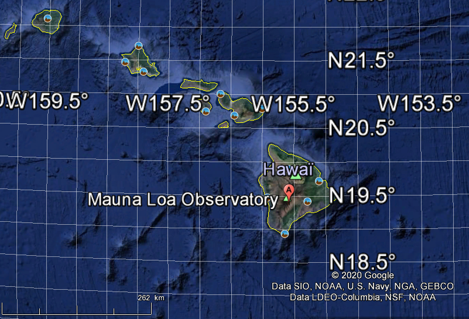  
**Figure 1 : Localisation du *Mauna Loa Observatory* (Hawaï, USA).**

# **2 Résultats**

## **2.1 Chargement des données initiales et création d’une série temporelle**

Le chargement du fichier initial (*hawai\_MD.csv*) et sa conversion en
série temporelle (*HawaiData\_ts*) ont été effectués à partir des
commandes R suivantes :

###### \-Création d’un dataframe (tableau initial)

``` r
HawaiData <- read.csv("Data/hawai_MD.csv")
colnames(HawaiData) <- c("Date", "CO2")
```

###### \-Transformation en *Time-Series*

``` r
HawaiData_ts <- ts(HawaiData, frequency = 12, start = c(1958,3))
```

La figure 2 donne un aperçu du tableau des données initiales *HawaiData*
et du tableau de la série temporelle *HawaiData\_ts*.

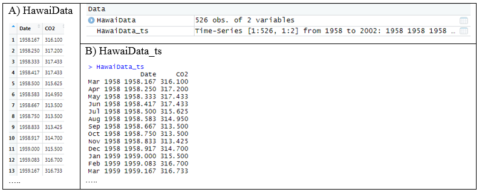  
**Figure 2 : Aperçu des tableaux *HawaiData* et *HawaiData\_ts*.**

## **2.2 Exploration des données brutes**

Le tableau initial *HawaiData* comprend 526 mesures de concentrations de
CO<sub>2</sub> atmosphérique prises au *Mauna Loa Observatory* (Hawaï)
accompagnées de leur date de collecte respective.

Les statistiques descriptives concernant ces variables apparaissent à la
figure 3 :

``` r
summary(HawaiData_ts)
```

    ##       Date           CO2       
    ##  Min.   :1958   Min.   :313.4  
    ##  1st Qu.:1969   1st Qu.:324.0  
    ##  Median :1980   Median :337.9  
    ##  Mean   :1980   Mean   :339.6  
    ##  3rd Qu.:1991   3rd Qu.:354.5  
    ##  Max.   :2002   Max.   :373.8

**Figure 3 : Statistiques descriptives des variables Date et
CO<sub>2</sub>.**

La figure 4 présente un histogramme des concentrations en CO<sub>2</sub>
atmosphérique mesurées au *Mauna Loa Observatory* entre 1958 et 2001. La
position de la moyenne des concentrations de CO<sub>2</sub> est
également présentée sur cette distribution.

``` r
q1 <- ggplot(HawaiData, aes(CO2)) +  
  geom_histogram(binwidth = 1, color = "brown", fill = "green")
countminC = min(ggplot_build(q1)$data[[1]]$count)
countmaxC = max(ggplot_build(q1)$data[[1]]$count)
HistoCO2 <- ggplot(HawaiData, aes(CO2)) +  
  geom_histogram(binwidth = 1, color = "brown", fill = "green") +
  geom_vline(aes(xintercept = mean(HawaiData$CO2)),
             color ="red", linetype ="dashed", size = 1) +
  geom_text(x = (mean(HawaiData$CO2)),
            y = ((countmaxC-countminC)/2),
            aes(fontface=2),label = "concentration moyenne", 
            color = "black", size = 4,srt = 90) +
  scale_x_continuous(breaks = seq(trunc(min(HawaiData$CO2)), ceiling(max(HawaiData$CO2)), by = 5)) +
  scale_y_continuous(breaks = seq(0, countmaxC, by = 2)) +
  labs(title = "Histogramme du CO2 atmosphérique au Mauna Loa Observatory (Hawaï) entre 1958 et 2002",
       x = "Concentration en CO2 atmosphérique (ppm)",
       y = "Fréquence")
plot(HistoCO2)
```

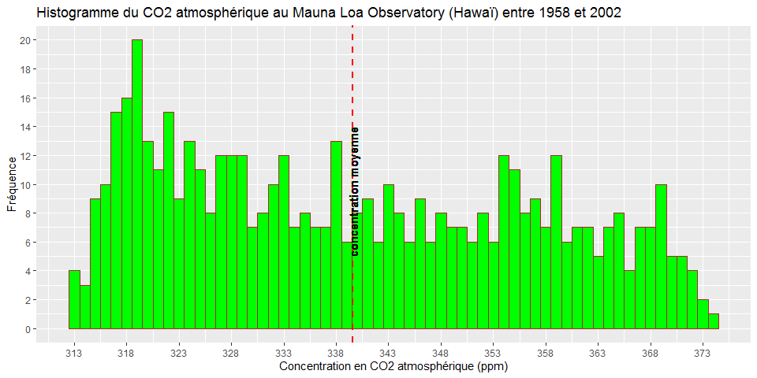<!-- -->
**Figure 4 : Histogramme des concentrations de CO<sub>2</sub>
atmosphérique.**

Cet histogramme présente un léger étirement (*skewness*) vers les
grandes valeurs de CO<sub>2</sub> témoignant ainsi de la possibilité
d’une série de données qui s’éloigne d’une distribution gaussienne
normale. La normalité de la distribution a été vérifiée à l’aide du code
R suivant :

``` r
#Vérification de la normalité du CO₂ atmosphérique
#a)Q-Q Plot
ggqqplot(HawaiData$CO2,
         main = "Graphique Q-Q plot du CO2",
         xlab = "Théorique",
         ylab = "Concentration en CO2 atmosphérique (ppm)")
```

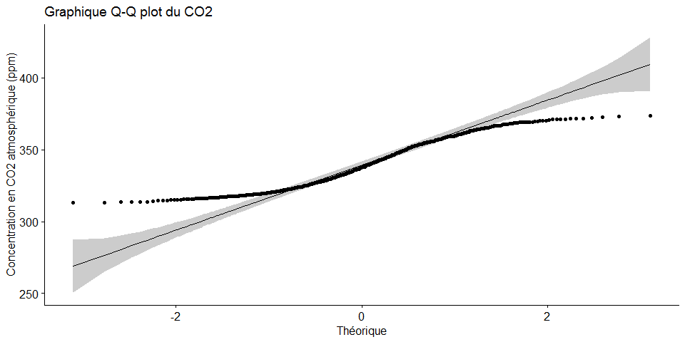<!-- -->

``` r
#b)test de normalité de Shapiro-Wilk (si p-value > 0.05 : normalité)
shapiro.test(HawaiData$CO2)
```

    ## 
    ##  Shapiro-Wilk normality test
    ## 
    ## data:  HawaiData$CO2
    ## W = 0.94137, p-value = 1.505e-13

**Figure 5 : Vérification de la normalité des concentrations de
CO<sub>2</sub>.**

La figure 5 illustre le graphique Q-Q plot accompagné du résultat du
test de normalité de Shapiro-Wilk. Ainsi, la distribution des données de
CO<sub>2</sub> ne suit pas une loi normale puisque la série s’éloigne de
la droite de distribution normale et que le test Shapiro-Wilk indique
une p-value significative (i.e. \< 0,05). À cette étape-ci, il aurait
été possible d’effectuer une transformation des données (ex : log)
afin de tendre vers la normalité mais comme les résultats logarithmiques
sont plus difficiles à interpréter, il a été décidé de continuer avec
les données de CO<sub>2</sub> non-transformées.

L’application des codes R suivants a permis d’observer une tendance à
long terme associée à une hausse généralisée des concentrations de
CO<sub>2</sub> au cours de la période 1958-2002 ainsi que la présence
d’une fluctuation saisonnière (courbe sinusoïdale) dans la série de
données (figures 6a et 6b) :

###### \-Graphique de la variation temporelle du CO₂:

``` r
HawaiData %>%
  ggplot(aes(x = Date, y = CO2)) +
  geom_line(color = "darkgreen", linetype = 1, size = 1) +
  scale_x_continuous(breaks = seq(trunc(min(HawaiData)), ceiling(max(HawaiData)), by = 4)) +
  scale_y_continuous(breaks = seq(trunc(min(HawaiData)), ceiling(max(HawaiData)), by = 10)) +
  labs(title = "Variation des concentrations de CO2 au Mauna Loa Observatory (Hawaï) entre 1958 et 2002",
       x = "Temps (année)",
       y = "Concentration en CO2 atmosphérique (ppm)")
```

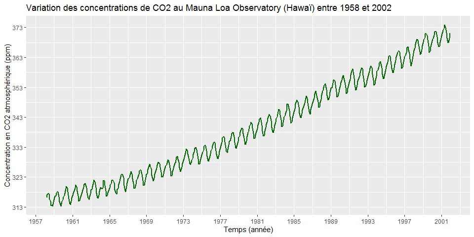<!-- -->
**Figure 6a : Variation temporelle des concentrations de
CO<sub>2</sub>.**

###### \-Graphique de la variation saisonnière de CO₂ (illustration partielle):

``` r
HawaiData_part <- HawaiData[which(HawaiData$Date > 1976 & HawaiData$Date < 1984),]
HawaiData_part %>%
  ggplot(aes(x = Date, y = CO2)) +
  geom_line(color = "darkgreen", linetype = 1, size = 1) +
  scale_y_continuous(breaks = seq(trunc(min(HawaiData[2])), ceiling(max(HawaiData[2])), by = 2)) +
  labs(title = "Variation des concentrations de CO2 au Mauna Loa Observatory (Hawaï) etre 1976 et 1984",
       x = "Temps (année)",
       y = "Concentration en CO2 atmosphérique (ppm)")
```

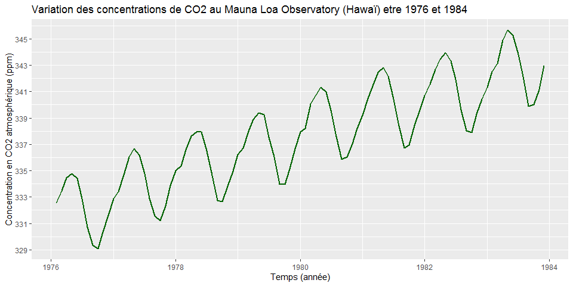<!-- -->
**Figure 6b : Variation saisonnière des concentrations de CO₂.**

Un graphique d’autocorrélation des concentrations de CO<sub>2</sub>
(figures 7a et 7b) montre la présence de sommets aux étapes saisonnières
(au-delà du seuil de probabilité de 95% indiquée par les lignes
pointillées bleues). Cette autocorrélation a été confirmée par un test
de Ljung-Box (p-value \< 0,05 : absence de « bruit blanc » et présence
d’une structure dans les données) :

``` r
HD_ggAcf <- ggAcf(HawaiData_ts[,2], ci = 0.95, type = c("correlation"), plot = TRUE) +
  labs(title = "CO2 : autocorrélation VS retardement",
       x = "Retardement (Lag)",
       y = "Coefficient d'autocorrélation (ACF)")
HD_ggAcf
```

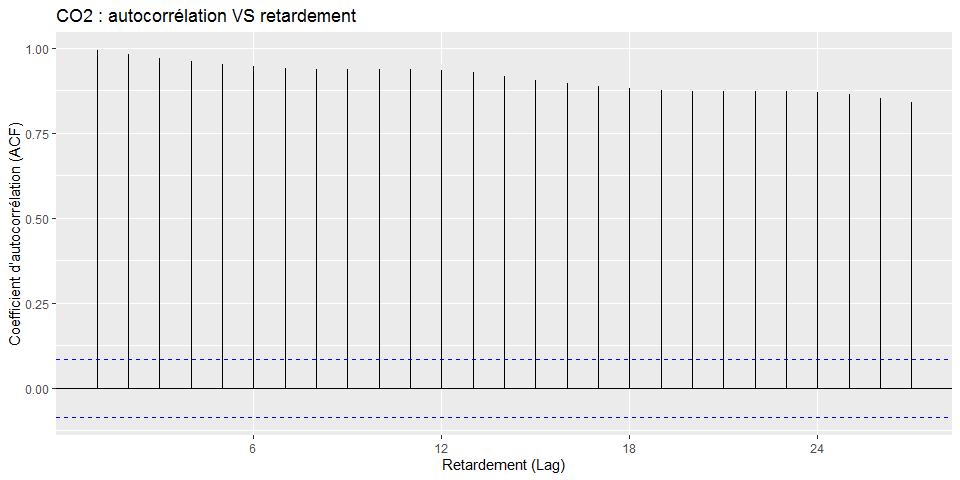<!-- -->
**Figure 7a : Autocorrélation entre les concentrations de CO₂.**

Le test de Ljung-Box permet de vérifier si la série temporelle entière
peut être différenciée d’un bruit blanc. Si p-value \< 0,05 : faible
possibilité de bruit blanc et présence d’une structure.

``` r
Box.test(HawaiData_ts[,2], lag = max(HD_ggAcf$data$lag), type = "Ljung-Box")
```

    ## 
    ##  Box-Ljung test
    ## 
    ## data:  HawaiData_ts[, 2]
    ## X-squared = 12216, df = 27, p-value < 2.2e-16

**Figure 7b : Résultat du test de Ljung-Box.**

L’analyse des seuils de signification de l’autocorrélation confirme la
possibilité de conduire la série temporelle de CO<sub>2</sub> vers un
processus de modélisation prédictive.

## **2.3 Modélisation de la série temporelle de CO₂**

L’objectif général de la modélisation des séries temporelles est la
**prévision** (*forecast*). La plupart des modèles se basent sur des
simulations de futurs possibles à partir desquelles sera déduit une
tendance centrale et des intervalles prévisionnels.

L’évaluation de la performance d’un modèle prévisionnel consiste à
confronter des données auparavant observées aux donnés qui les précèdent
et d’en analyser les résidus (i.e. différence entre une donnée observée
et son équivalent en mode prévisionnel). Pour ce faire, il est
nécessaire d’avoir deux jeux de données : un **jeu d’entraînement**
(*training set*) et un **jeu de test** (*test set*). Le jeu
d’entraînement sert à lisser le modèle pour en découvrir les
structures alors que le jeu de test sert à évaluer la performance du
modèle sur des données observées mais inconnues du modèle afin de
vérifier les structures découvertes par le modèle.

Dans un modèle prévisionnel, **l’extrapolation** est de mise car le
futur est inconnu. Ainsi, la performance d’un modèle prévisionnel est
évaluée par sa capacité à extrapoler (i.e. prédire au-delà des données
observées ayant servie à la calibration). Cette évaluation se fait à
l’aide de différentes statistiques, telle que l’erreur moyenne absolue
échelonnée (*mean absolute scaled error* : MASE). Cette statistique ne
dépend pas de la métrique de la variable produite : plus la MASE se
rapproche de zéro (0), plus le modèle simule une bonne prévision.

### **2.3.1 Séparation des données en jeux d’entraînement et de test**

Le code R suivant a permis de séparer la série de 526 données en deux
jeux; les 70 % premières données ont servi comme jeu d’entrainement
alors que les 30% données suivantes ont servi comme jeu de test :

``` r
##Séparation des données en deux jeux : entraînement (70%) et test (30%)
HawaiData_tsX <- HawaiData_ts[,2]
#jeu d'entraînement
HawaiTrain <- window(HawaiData_tsX, start = 1958.16667, end = 1988.917)
#jeu de test
HawaiTest <- window(HawaiData_tsX, start = 1989.00, end = 2001.91667)
```

De cette façon, le jeu d’entraînement contient 370 données alors que le
jeu de test contient 156 données. Un examen de ces deux jeux de données
de CO<sub>2</sub> à l’aide d’un diagramme en boîtes à moustaches
accompagnées d’encoches (V-notch) indique que leurs distributions
accusent une différence significative au seuil 95% (figures 8a et 8b :
les encoches ne coïncident pas). Les codes R suivants ont permis
d’obtenir les statistiques :

``` r
#Statistiques descriptives des données Train et Test
summary(HawaiTrain) #données d'entraînement
```

    ##    Min. 1st Qu.  Median    Mean 3rd Qu.    Max. 
    ##   313.4   320.9   329.1   330.5   339.4   354.2

``` r
summary(HawaiTest) #données de test
```

    ##    Min. 1st Qu.  Median    Mean 3rd Qu.    Max. 
    ##   349.9   356.0   360.7   361.3   366.7   373.8

**Figure 8a : Statistiques des jeux d’entraînement (HawaiTrain) et de
test (HawaiTest).**

``` r
##BOXPLOT des données Train et Test (avec V-notch)
#A)préparation des données
#copies des jeux 
HawaiTrainX <- HawaiData[which(HawaiData$Date >= min(HawaiData$Date) 
                               & HawaiData$Date < 1989.0),]
HawaiTestX <- HawaiData[which(HawaiData$Date >= 1989.0 
                               & HawaiData$Date <= max(HawaiData$Date)),]
#codification (factor) des données Train et Test
#-ajouter une variable Code-facteur "Entraînement" aux données Train
HawaiTrainX$Code <- (HawaiTrainX / HawaiTrainX)
HawaiTrainX$Code <- as.factor(HawaiTrainX$Code)
HawaiTrainX$Code = "Entraînement"
HawaiTrainX$Code <- as.factor(HawaiTrainX$Code)
#-ajouter une variable Code-facteur "Test" aux données Test
HawaiTestX$Code <- (HawaiTestX[2] / HawaiTestX[2])
HawaiTestX$Code <- as.factor(HawaiTestX$Code)
HawaiTestX$Code = "Test"
HawaiTestX$Code <- as.factor(HawaiTestX$Code)
#-réunion des deux tables Train et Test avec Codification (factor)
HawaiTrainTest <- bind_rows(HawaiTrainX, HawaiTestX)
#B)Création des boxplots
ggplot(HawaiTrainTest, aes(Code, CO2, fill = Code, colour = Code)) +
  geom_boxplot(show.legend = FALSE,
               color = "brown", alpha=0.25,
               notch = TRUE, notchwidth = 0.5,
               coef = 1.5, outlier.colour = "red", 
               outlier.fill = "red", outlier.shape = 20,
               outlier.size = 6, outlier.alpha = 0.5, na.rm = TRUE) +
  geom_jitter(show.legend = FALSE, fill = "black") +
  stat_summary(fun = mean, geom = "point",
               shape = 22, fill = "darkgreen", 
               color = "white", size = 5, 
               alpha = 0.5, na.rm = TRUE) +
  theme(axis.text.x = element_text(size=12)) +
  scale_y_continuous(breaks = seq(trunc(min(HawaiData[2])), ceiling(max(HawaiData[2])), by = 10)) +
  labs(title = "Diagrammes en boîte à moustaches du CO2 atmosphérique",
       x = "Groupes de données",
       y = "Concentration en CO2 atmosphérique (ppm)")
```

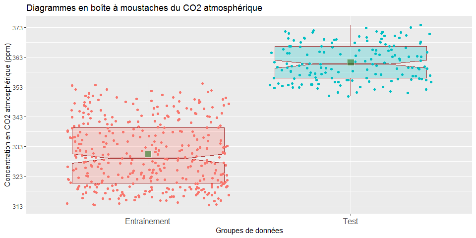<!-- -->
**Figure 8b : Box-Plot des jeux d’entraînement (HawaiTrain) et de test
(HawaiTest).**

### **2.3.2 Création et projection d’un modèle ETS**

Plusieurs modèles de prévision sont disponibles (naïve, SES, ARIMA, …).
Dans ce Devoir, le **modèle ETS** \[Erreur-Tendance-Saison\] a été
choisi car il donne aux valeurs précédentes des poids décroissants selon
leur ancienneté. La prévision par ETS repose sur la moyenne pondérée des
dernières observations, en donnant plus de poids aux données les plus
récentes.

L’erreur du modèle peut être calculée de sorte qu’elle soit constante ou
augmente selon le niveau de décalage (i.e. retardement, *lag*). Le
modèle ETS permet d’automatiser la combinaison Erreur-Tendance-Saison
\[ETS(Z,Z,Z)\] où Z peut prendre les modes A (additif), M
(multiplicatif) et N (sans tendance). Les codes R suivants ont été
utilisés pour effectuer la modélisation ETS et pour projeter la
prévision (figures 9a et 9b) :

###### \-Modélisation:

``` r
CO2_ets <- HawaiTrain %>% ets(model = "ZZZ", damped = NULL)
CO2_ets %>% autoplot()
```

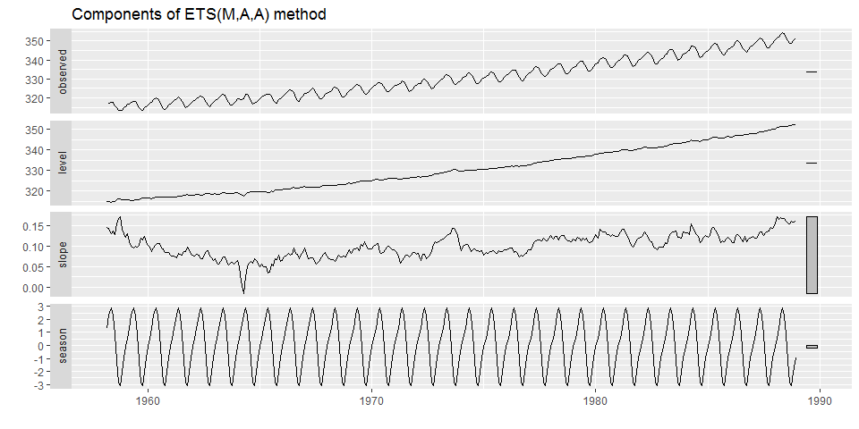<!-- -->
**Figure 9a : Modélisation ETS : composantes.**

###### \-Prédiction:

``` r
CO2_forecast <- CO2_ets %>% forecast(h = length(HawaiTest))
CO2_forecast %>% autoplot()
```

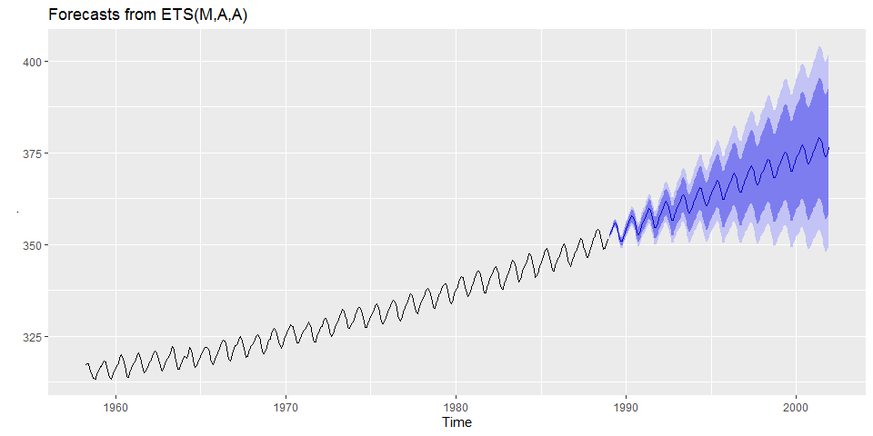<!-- -->

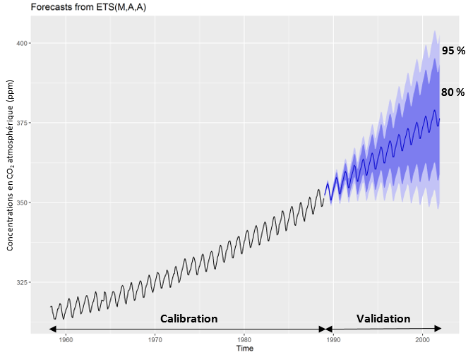{width = 300px}  
**Figure 9b : Modélisation ETS : prédiction.**

La figure 10 présente les statistiques associées à cette modélisation
ETS (i.e. Training set error measures) ainsi que la valeur des
différents paramètres d’ajustement (i.e. alpha, beta, gamma, …).

``` r
summary(CO2_ets)
```

    ## ETS(M,A,A) 
    ## 
    ## Call:
    ##  ets(y = ., model = "ZZZ", damped = NULL) 
    ## 
    ##   Smoothing parameters:
    ##     alpha = 0.6379 
    ##     beta  = 0.0258 
    ##     gamma = 1e-04 
    ## 
    ##   Initial states:
    ##     l = 314.825 
    ##     b = 0.1447 
    ##     s = 1.3229 0.5637 -0.0601 -0.9393 -2.0446 -3.059
    ##            -2.8966 -1.156 0.7924 2.2806 2.8774 2.3187
    ## 
    ##   sigma:  0.001
    ## 
    ##      AIC     AICc      BIC 
    ## 1413.289 1415.033 1479.773 
    ## 
    ## Training set error measures:
    ##                       ME      RMSE      MAE          MPE       MAPE      MASE
    ## Training set 0.001668685 0.3344654 0.251712 0.0002860883 0.07648212 0.2048202
    ##                    ACF1
    ## Training set 0.08013379

**Figure 10 : Statistiques de la modélisation ETS.**

Le modèle ETS obtenu **(M,A,A)** indique une erreur de type M
(multiplicative), une tendance de type A (additive) et une saisonnalité
de type A (additive). La prédiction des concentrations de CO<sub>2</sub>
simulées par le modèle ETS à partir de l’année 1989 s’inscrit à
l’intérieur de deux niveaux de probabilités, soit 80% (bleu foncé) et
95% (bleu pâle). Les statistiques de la modélisation ETS indiquent une
MASE de 0,205 et une RMSE de 0,334.

### **2.3.3 Analyse des résidus**

Pour une série temporelle, la validité d’un modèle prévisionnel consiste
à vérifier si les **résidus** ne sont pas corrélés (i.e. ne forment pas
un « bruit blanc »). Idéalement, les résidus doivent être distribués
normalement, avoir une variance constante et une valeur moyenne de 0.
L’analyse des résidus du modèle ETS créé précédemment a été effectuée
à partir des codes R suivants :

###### \-Test de Ljung-Box (si p-value \> 0.05 : présence de bruit blanc):

``` r
#-test de Ljung-Box (si p-value > 0.05 : présence de bruit blanc)
CO2_ets %>% checkresiduals()
```

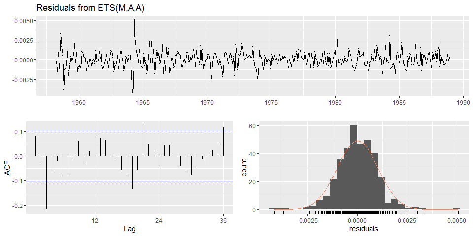<!-- -->

    ## 
    ##  Ljung-Box test
    ## 
    ## data:  Residuals from ETS(M,A,A)
    ## Q* = 55.243, df = 8, p-value = 3.961e-09
    ## 
    ## Model df: 16.   Total lags used: 24

###### \-Test de Shapiro-Wilk (si p-value \> 0.05 : normalité)

``` r
#-test de Shapiro-Wilk (si p-value > 0.05 : normalité)
shapiro.test(residuals(CO2_ets))
```

    ## 
    ##  Shapiro-Wilk normality test
    ## 
    ## data:  residuals(CO2_ets)
    ## W = 0.97163, p-value = 1.292e-06

**Figure 11 : Résultat de l’analyse des résidus du modèle ETS.**

La figure 11 illustre les résultats de l’analyse des résidus du modèle
ETS. Des tests de normalité de Ljung-Box et Shapiro-Wilk accompagnent
cette analyse.Le test de Ljung-Box indique une p-value de
3,9•10<sup>-9</sup>, ce qui signifie une très faible possibilité de «
bruit blanc » alors que le test de Shapiro-Wilk indique une p-value de
1,3•10<sup>-6</sup>, ce qui signifie que les résidus ne sont pas
distribués selon un modèle normal (i.e. présence de valeurs aberrantes
aux extrémités de la distribution des données de CO<sub>2</sub>).

# **3 Conclusion**

Cette 5ème Évaluation sommative du cours GAA-7007 constitue une
application de la data science à la recherche en agroenvironnement. Elle
s’inscrit dans le domaine de pointe de l’analyse et de la modélisation
des agroécosystèmes. Son originalité repose sur l’utilisation des
procédures d’analyse et de modélisation des séries temporelles ainsi
que de simulation des prévisions (*forecasting*).
